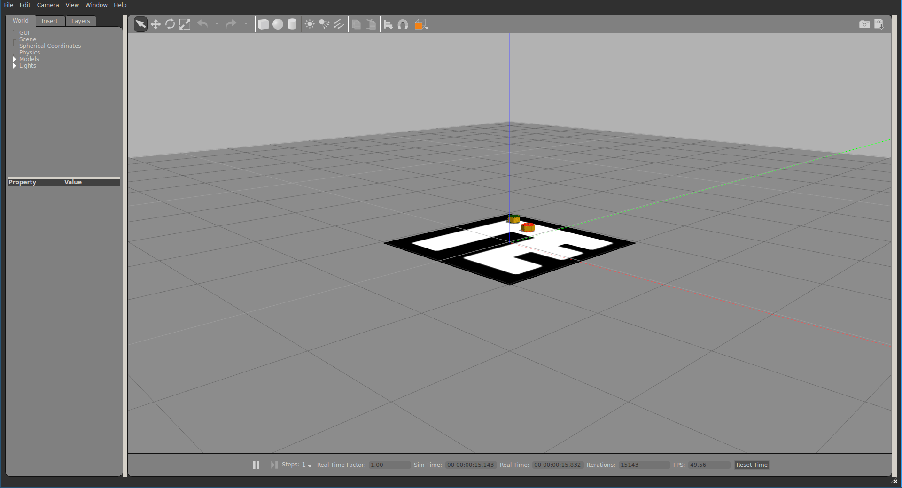
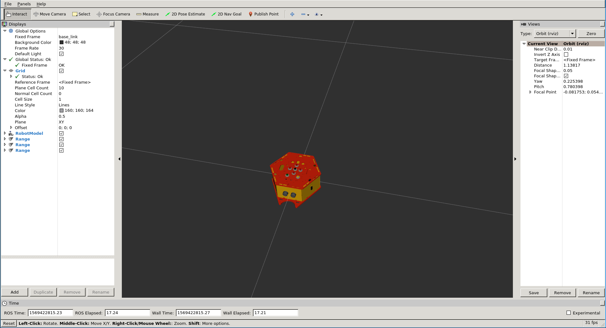

# Robocake

Programming Robocake robots using ROS in a Gazebo simulated environment.

## Prerequisites

The project was developed primarily using ROS Kinetic (Ubuntu 16.04 LTS), but
should work with ROS Melodic (Ubuntu 18.04 LTS) and possibly other operating
systems.

Requirements:

- Ubuntu 16.04 LTS
- ROS Kinetic Kame full desktop installation
  ([instructions](https://wiki.ros.org/kinetic/Installation/Ubuntu))
- Gazebo 7
  ([instructions](http://gazebosim.org/tutorials?tut=install_ubuntu&cat=install))

## Setup

For general tutorials on getting started with ROS, see
[ROS wiki](https://wiki.ros.org/ROS/Tutorials). Tutorials for specific steps will
be linked where appropriate.

1. Create a catkin workspace. [Catkin](https://wiki.ros.org/catkin) is a tool
   used for building ROS packages. See
   [instructions](https://wiki.ros.org/catkin/Tutorials/create_a_workspace).

   `mkdir -p ~/catkin_ws/src`

   `cd ~/catkin_ws`

   `catkin_make`

2. Activate the workspace.

   `source ~/catkin_ws/devel/setup.bash`

   If you are using `zsh`, source the `setup.zsh` file instead.

   Note that this needs to be done every time you want to run the project from a
   newly opened shell. To make this automatic, run the following command:

   `echo "source ~/catkin_ws/devel/setup.bash" >> ~/.bashrc`

   Or the equivalent for `.zshrc` if you are using `zsh`.

3. Clone this repository into `~/catkin_ws/src`

   `cd ~/catkin_ws/src`

   `git clone <address>`

4. Build the project. See
   [catkin tutorial](https://wiki.ros.org/catkin/Tutorials/using_a_workspace)
   for more information.

   `cd ~/catkin_ws`

   `catkin_make`

5. To test if everything is set up correctly, run the demo simulation.

   `roslaunch robocake_gazebo demo.launch`

   This should open a Gazebo window showing two robots chasing each other around.

   

   See [wiki page](https://wiki.ros.org/roslaunch) for more information on using
   `roslaunch`.

## Overview

The project contains four packages. Here is a high level overview of them.

### robocake\_description

Contains descriptions of the two Robocake robots in xml-based
[urdf](https://wiki.ros.org/urdf) format.

The `urdf` folder contains definitions of each moving part or sensor that a
robot is build from. The `robots` folder contains files that assemble these
parts into a whole robot.

The `meshes` folder contains 3d models of each of these parts. For some of the
more complex ones there are simplified versions of them for collision detection.

The package includes a launch file for opening a robot model in
[rviz](https://wiki.ros.org/rviz). It displays the robot's model and can also be
used vor visualizing things like odometry or sensor readings.

The `model` argument is used to determine which robot to display.

`roslaunch robocake_description rviz.launch model:=green`

or

`roslaunch robocake_description rviz.launch model:=orange`

### robocake\_gazebo

Contains configuration for simulating the robots in Gazebo.

The following launch files are included:

- `demo.launch` - a demo simulation with two robots.

- `gazebo.launch` creates an empty simulated world. After running this one,
  multiple robots can be spawned from separate shells.

  `roslaunch robocake_gazebo gazebo.launch`

  The texture of the floor can be changed by replacing or editing
  `models/floor.png`. The description of the world is located in
  `worlds/room.world`. See
  [specification](http://sdformat.org/spec?ver=1.6&elem=world) of the file
  format.

- `spawn.launch` spawns a new robot into the world. This accepts a number of
  parameters:

  - `model` - either `green` or `orange`. The only required argument.

  - `algorithm` - whether to run a default movement algorithm associated with a
    robot. See `robocake_algorithm`. Defaults to false.

  - `robot_name` - used to differentiate between multiple robots. By default a
    long unique name is generated. This can be used to assign a shorter, more
    readable name.

  - `x`, `y` `theta` - initial coordinates and orientation (angle in radians).

  Example usage:

  `roslaunch robocake_gazebo spawn.launch model:=green robot_name:=robocake x:=1 y:=0.5`

### robocake\_controllers

Configures a differential drive controller for use with two-wheeled Robocake
robots. See [wiki page](https://wiki.ros.org/diff_drive_controller) for list of
parameters.

The controller converts linear and angular velocity commands into wheel
movements. It accepts input on the `cmd_vel` topic. See the
[tutorial](http://wiki.ros.org/ROS/Tutorials/UnderstandingTopics) on
understanding ROS topics.
